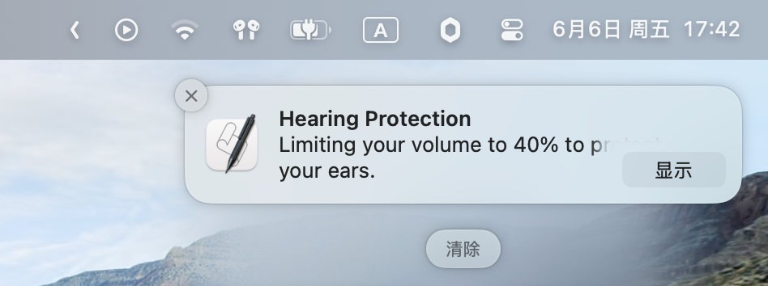

# A Script to Limit Max Volume on macOS


*(A notification shows when the current volume exceeds the preset value.)*

**Source:** This script is posted from the [Raddit Post](https://www.reddit.com/r/MacOS/comments/btki3j/limit_the_maximum_volume_in_mac_os_to_protect) and now slightly modified by me.

# Usage
## Run Manually
You can run `volimiter.scpt` manually when needed with Apple Script Editor. But if you want to run it automatically at login and sliently, just follow the bellow steps.

## Add to LaunchAgent
1. Copy `volimiter.scpt` into `~/Library/Scripts`.
2. Create plist file named `com.user.volimiter.plist` in `~/Library/LaunchAgents` and write the following codes:
```xml
<?xml version="1.0" encoding="UTF-8"?>
<!DOCTYPE plist PUBLIC "-//Apple//DTD PLIST 1.0//EN" "http://www.apple.com/DTDs/PropertyList-1.0.dtd">
<plist version="1.0">
<dict>
    <key>KeepAlive</key>
    <true/>
    <key>Label</key>
    <string>com.user.volimiter</string>
    <key>ProgramArguments</key>
    <array>
        <string>/usr/bin/osascript</string>
        <string>-l</string>
        <string>JavaScript</string>
        <string>/Users/<YOUR_USERNAME>/Library/Scripts/volimiter.scpt</string>
    </array>
    <key>RunAtLoad</key>
    <true/>
    <key>StandardErrorPath</key>
    <string>/tmp/volimiter.err</string>
    <key>StandardOutPath</key>
    <string>/tmp/volimiter.log</string>
</dict>
</plist>
```
**Remember to replace `<YOUR_NAME>` into your actually user directory name.**

3. Load this plist
In Terminal, run the following command to run this script automatically:
```sh
launchctl load ~/Library/LaunchAgents/com.user.volimiter.plist
```
4. To stop it:
```sh
launchctl unload ~/Library/LaunchAgents/com.user.volimiter.plist
```
